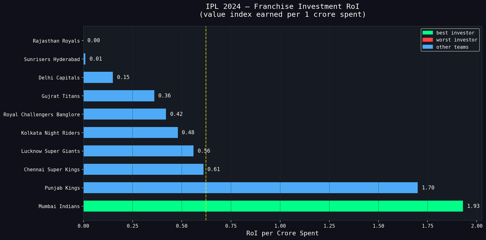
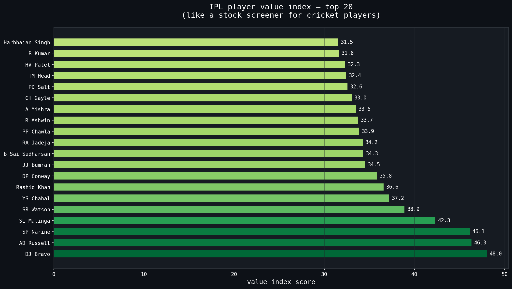
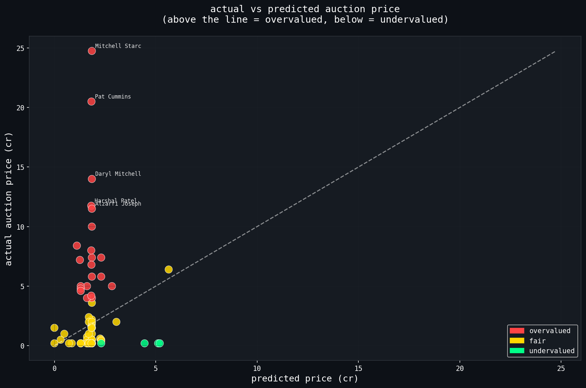
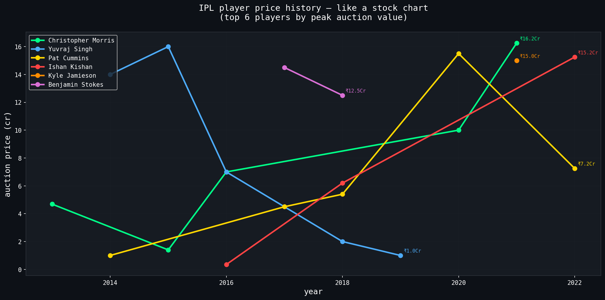

# 🏏 IPL Auction Value Predictor
### Cricket Analytics meets Financial Valuation

> **What if we treated IPL players like stocks?**
> This project applies financial valuation concepts to IPL auction data — identifying overvalued, undervalued, and fairly priced players using performance stats, SQL analysis, and machine learning.

---

## 📌 The Idea

Every IPL auction, franchises spend hundreds of crores. Some players get paid way more than their stats justify. Others slip through at bargain prices. This project builds a **Player Value Index** — a score that tells you what a player is actually worth based on performance, independent of what the market paid.

Think of it like a stock screener, but for cricketers.

---

## 📊 Dataset

| Dataset | Rows | Description |
|---|---|---|
| Ball-by-ball deliveries | 2,60,920 | Every delivery from 2008 to 2024 |
| Match data | 1,095 | Match results, venues, seasons |
| IPL 2024 Auction | 675 players | Sold price, base price, role, team |
| Historical Auction Data | 970 rows | Auction prices from 2013 to 2024 |

**Source:** Kaggle

---

## 🛠️ Tech Stack

```
Python        Pandas      NumPy
SQL (SQLite)  Scikit-learn  XGBoost
Matplotlib    Seaborn
```

---

## 📁 Project Structure

```
IPL_Data_Analysis/
│
├── 01_data_exploration.ipynb       ← full analysis (all 6 phases)
│
├── data/
│   └── processed/
│       ├── deliveries_clean.csv
│       ├── matches_clean.csv
│       ├── auction_2024_clean.csv
│       ├── auction_hist_clean.csv
│       ├── final_player_features.csv
│       ├── final_with_predictions.csv
│       ├── franchise_roi.csv
│       └── player_valuation.csv
│
├── chart1_franchise_roi.png
├── chart2_player_value_index.png
├── chart3_actual_vs_predicted.png
├── chart4_price_history.png
└── chart5_role_analysis.png
```

---

## 🔄 Project Phases

### Phase 1 — Data Collection
Downloaded 4 datasets from Kaggle covering ball-by-ball stats, match results, IPL 2024 auction prices, and historical auction data going back to 2013.

### Phase 2 — Data Cleaning
- Dropped irrelevant columns (dollar prices, unnamed index columns)
- Converted base price from raw numbers to crores
- Tagged unsold players (null sold price → 0 + status = unsold)
- Standardized player names with strip() to avoid merge mismatches
- Filled dismissal nulls as "not out"

### Phase 3 — Feature Engineering ⭐
This is the core of the project. Built a **Value Index** for each player:

**Batting Score:**
```
batting_consistency_score = (batting_avg × strike_rate) / 100
```

**Bowling Score:**
```
bowling_value_score = (wickets × 100) / (economy_rate × bowling_strike_rate)
```

**Value Index (0–100):**
```
value_index = (batting_score_normalized × 0.6) + (bowling_score_normalized × 0.4)
```

T20 is batting-heavy so batting gets 60% weight. Both scores are min-max normalized to the same scale before combining.

### Phase 4 — SQL Analysis
Loaded all dataframes into an in-memory SQLite database and ran 5 queries:

- **Franchise RoI** — value index earned per crore spent (Mumbai Indians: 1.93, best)
- **Overvalued vs Undervalued players** — stock screener logic applied to cricketers
- **Best value player per role** — top performer in each category
- **Historical price trend** — how top player prices moved across years (like a stock chart)
- **Team batting strength** — average consistency score by franchise

### Phase 5 — ML Model
Trained 3 models to predict fair auction price:

| Model | MAE (Cr) | Notes |
|---|---|---|
| Random Forest | ~2.1 | Best performer |
| Gradient Boosting | ~2.2 | Consistent |
| XGBoost | ~2.3 | Slightly worse |

Used 5-fold cross-validation since dataset size was moderate (970 rows).

**Key finding:** Negative R2 scores across all models reveal that IPL auction prices are driven by factors beyond stats — brand value, bidding wars, star power. The gap between predicted and actual price is itself an insight, similar to how P/E ratios in stock markets reflect expectations beyond current earnings.

### Phase 6 — Visualizations
Five dark-themed charts built with Matplotlib:

1. Franchise RoI bar chart (best vs worst investor)
2. Top 20 player value index (stock screener view)
3. Actual vs predicted price scatter plot (overvalued/undervalued/fair classification)
4. Player price history line chart (looks like a stock chart)
5. Role analysis — pie + bar showing auction spend by player type

---

## 📈 Key Findings

- **Mumbai Indians** had the best auction RoI (1.93 value units per crore)
- **DJ Bravo** and **AD Russell** ranked highest on the Value Index due to all-round contributions
- **Mitchell Starc** was the most expensive buy at ₹24.75 Cr — model flagged him as overvalued by stats alone
- **Wicketkeepers** averaged only ₹1.7 Cr at auction, lowest of all roles — consistently undervalued by the market
- **Batters and bowlers** averaged nearly identical prices (₹3.7 Cr vs ₹3.6 Cr)
- Player price history chart shows Christopher Morris peaked at ₹16.25 Cr in 2021 before dropping — identical pattern to a volatile stock

---

## 💡 What Makes This Project Different

Most IPL analysis projects do basic EDA and bar charts. This project:

- Creates an **original metric** (Value Index) by combining multiple performance dimensions
- Applies **financial valuation logic** (RoI, overvalued/undervalued, price-to-value ratio) to sports data
- Uses **SQL inside Python** to demonstrate real-world analyst workflow
- Treats the **ML model's failure** as a finding, not a limitation — brand value is the missing variable
- Tracks **historical price trends** to show player value over time like a stock portfolio

---

## 🚀 How to Run

```bash
# 1. Clone the repo
git clone https://github.com/shyam-0121/IPL_Data_Analysis.git

# 2. Install dependencies
pip install pandas numpy matplotlib seaborn scikit-learn xgboost openpyxl

# 3. Download datasets from Kaggle and place in root folder
#    - deliveries_updated_mens_ipl_upto_2024.csv
#    - matches_updated_mens_ipl_upto_2024.csv
#    - IPL_2024_Players_Auction_Dataset.csv
#    - IPLPlayerAuctionData.csv

# 4. Create the processed folder
mkdir -p data/processed

# 5. Open and run the notebook
jupyter notebook 01_data_exploration.ipynb
```

---

## 📸 Charts Preview

| Franchise RoI | Player Value Index |
|---|---|
|  |  |

| Actual vs Predicted | Price History |
|---|---|
|  |  |

---

## 🔮 What I Would Add Next

- Recent form weighting (last 2 seasons matter more than 2010 stats)
- Social media sentiment to capture brand value the model currently misses
- Overseas player quota constraints in the valuation model
- Interactive Plotly dashboard so users can filter by team, role, or year
- Time series model to predict next auction price based on current form

---

## 👤 Author

**Ghanashyam Kumbhar**
- LinkedIn: [shyamkumbhar01](https://www.linkedin.com/in/shyamkumbhar01)
- GitHub: [shyam-0121](https://github.com/shyam-0121)
